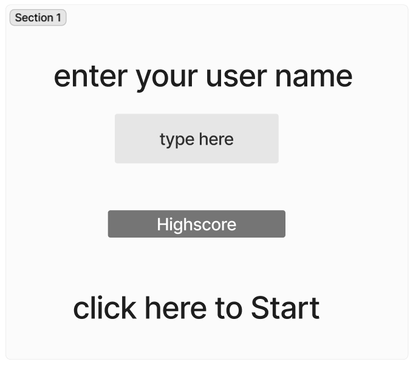
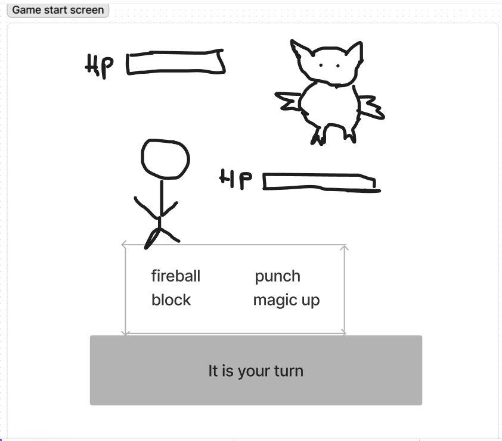
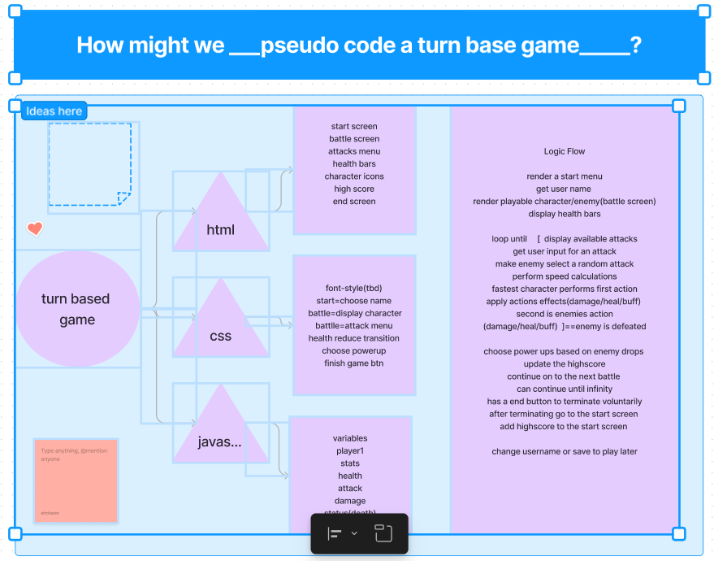

# Turn Based Game

## Description

This is my project proposal for a turn-based game I am making. It is a single player endless role-playing game in which you defeat enemies, steal their loot and level up to become infinitely stronger as you want to be. Each battle ends with you defeating the enemy or by being defeated. Defeating the enemy allows you to get power ups in the form of a choice while losing sends you back to the home screen where your highscore is displayed. You may choose to replay the game any time, but you will start at the beginning each time. I look forward to making this game and may update it with a save feature if required.

**Start Screen**

My Goals

- As a player I would like to know If I won the battle
- As a player I would like to know my characters remaining health
- As a player I would like to know my enemies health
- As a player I would like to have a visual representation of health changing
- As a player I would like to have an animation for an attack
- As a player I would like to have a way to stop the game
- As a player I would like to keep track of the highscore

Stretch Goals

- As a stretch goal I would like to add a save state
- As a stretch goal I would like to add different character sprites
- As a stretch goal I would like to add animations
- As a stretch goal I would like to add SFX

| **Day** | **Task** | **Blockers** | **Notes/ Thoughts** |
| --- | --- | --- | --- |
| Monday | Make proposal getting started |     |     |
| Tuesday | Write out the html  And create screens. |     |     |
| Wednesday | Add basic css and functionality |     |     |
| Thursday | Improve functionality |     |     |
| Friday | Flesh out animations and design |     |     |
| Saturday | Review code for multiple steps and bugs |     |     |
| Sunday | Improve anything  Lacking. |     |     |