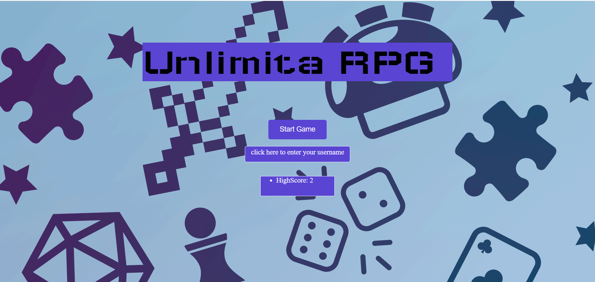
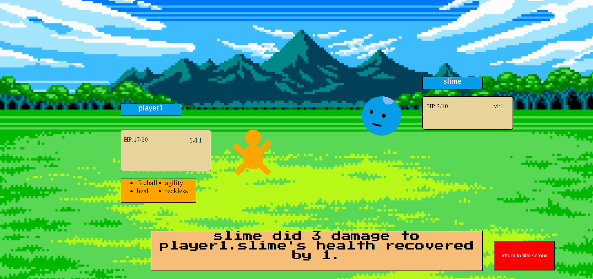
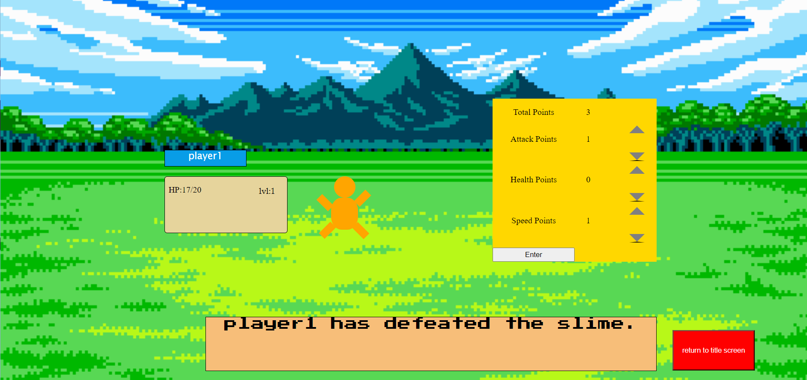

# Unlimita-RPG

## Description

This is my READ ME for the turn based game unlimita rpg. Having played many turn based rpg games I always imagined the workings behind one and how difficult it might be to make one. I wanted to make a simple game that took elements from many rpg adventure games which had turned based mechanics and remove the advenure part to focus on making it a pure turn based strategy game. The player battles with their arch nemesis the slime which gets stronger with each victory for the player. As you defeat enemeies [slimes are our only enemy at the moment] your highscore increases by the number of victories the you achieve. get a highscore by strategically investing points in to your player as you level up to create a character that can take down more powerful slimes.  

## Technologies Used

HTML,CSS,Javascript

## Getting Started

https://unlimita-7un7621lz-sricharans-projects-574a6f51.vercel.app

you may choose to enter your name before starting the game. It will allow your username to be displayed when displaying highscore as you return to the title screen. It also allows the player name to be the same as your username. As of now no username info is being stored anywhere. 

## wireFrames/screenShots

## Timeline

| **Day** | **Tasks** | **Goal completion** | **Notes/ Thoughts** |
| --- | --- | --- | --- |
| 3/18 | Define constants classes,functions and event listeners |  Y   |  added html elements and classes and stuff   |
| 3/19 | Improve functioning and get a running prototype |  N   |  had issues with implementing turn orders  |
| 3/20 | work on adding css to the game and improve visibility|  Y   |  added grids  and backgrounds  |
| 3/21 | get feedback from instructors on necessary changes |   Y  | got help and feedback from instructors  |
| 3/22 | work on adding endless mode and highscore as well as enchancement screen |   N  | changed up this plan slightly    |
| 3/23 | add sprites animations sfx and other stretch goals|   N  |  did not have time to implements animations and sfx   |
| 3/24 | review code get feedback and have others test it and make improvements/check for bugs|  Y   |  fixed functionality  problems |

## Attributions

The background for the battle scene: https://64.media.tumblr.com/00ec803404f6e9d6583f92d8870b5fb8/tumblr_p7k8f3fMWS1wvbydeo1_1280.png
The background for the start screen: https://pbs.twimg.com/media/GHmHx-bWgAAmMgB.png:large

## Next Steps

-I plan on working to implement different enemy sprites, different enemies and enemy attacks
-I plan on working to add different battle scenes
-I plan on working to use sound effects for attacks
-I plan on working to make different player moves that the player can slot in
-I plan on adding save progress functionality 
